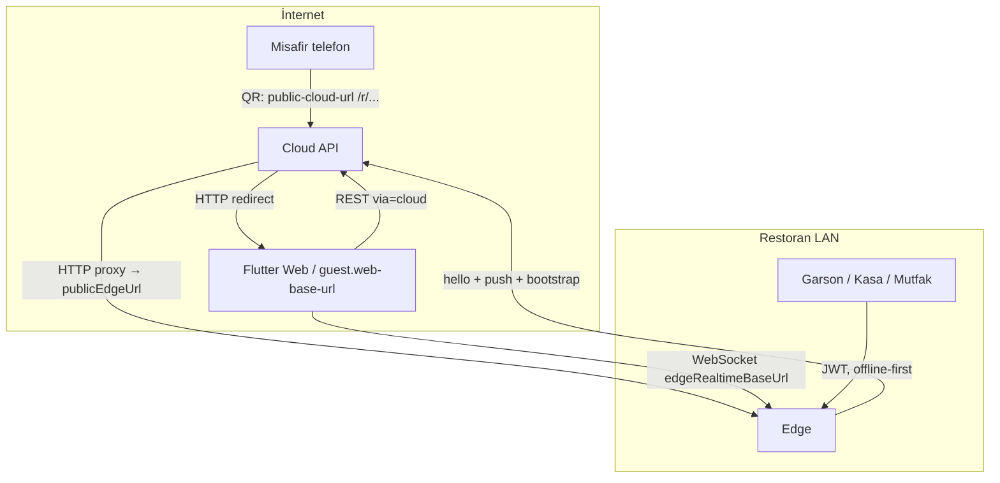

# QuickServe — Cloud ve Edge: İnternet Altyapısı

**Son güncelleme:** 2026-05-19  
**İlgili kod:** `edge` sync/discovery, `cloud` guest BFF, `config/quickserve-config.sample.yaml`  
**Ürün planı:** [QUICKSERVE_PLAN.md](./QUICKSERVE_PLAN.md)

Bu belge, QuickServe’i **internete açtığınızda** Cloud ile Edge’in nasıl konuştuğunu, hangi URL’lerin ne işe yaradığını ve üretim ortamında altyapının nasıl kurulacağını açıklar.

---

## 1. Özet

QuickServe **hibrit** çalışır:

- **Cloud:** Merkez (süperadmin, abonelik, senkron omurgası, misafir BFF).
- **Edge:** Restoran başına (Raspberry Pi vb.) — günlük operasyon, offline-first, LAN personeli.

İnternete açılış **tek bir sihirli bağlantı değildir**; üç ayrı trafik hattı vardır. En kritik nokta: **senkron Edge → Cloud yönünde NAT arkasında da çalışır**; **misafir siparişi için Cloud’un Edge’e geri HTTP atması** gerekir ve Edge’in `public-edge-url` adresi internetten erişilebilir olmalıdır (veya mimari Cloud-first’a evrilir).

---

## 2. Trafik hatları (mevcut kod)



### 2.1 Senkron ve heartbeat (Edge → Cloud)

| Özellik | Değer |
|---------|--------|
| **Yön** | Edge başlatır (çıkış trafiği) |
| **NAT** | Genelde sorunsuz (ev/iş router) |
| **Endpoint’ler** | `POST /api/v1/sync/edge/hello`, `POST /api/v1/sync/push`, `GET /api/v1/sync/watermark`, `GET /api/v1/sync/bootstrap` |
| **Kod** | `EdgeDiscoveryService`, `EdgeHeartbeatScheduler`, `RestCloudGateway`, `cloud` → `SyncController` |

Edge açılışta ve periyodik olarak (~60 sn, `quickserve.edge.discovery.hello-interval-ms`) Cloud’a **hello** gönderir. Cloud `edge_sync_checkpoint` tablosuna kaydeder:

- `edge_id`, `registered_restaurant_id`
- `public_edge_url` (Edge’in bildirdiği dış adres)
- `last_hello_at` (çevrimiçi / çevrimdışı için)

Edge ayrıca değişiklikleri **outbox** üzerinden `POST /sync/push` ile Cloud’a iter (LWW birleştirme).

### 2.2 Misafir REST (Müşteri → Cloud → Edge)

| Özellik | Değer |
|---------|--------|
| **Yön** | Müşteri Cloud’a; Cloud Edge’e proxy |
| **NAT** | Cloud’un Edge’e **gelen** istek atması gerekir |
| **Endpoint’ler** | `GET/POST /api/v1/public/guest/r/{restaurantId}/t/{tableId}/{token}/...` |
| **Kod** | `PublicGuestRestController`, `EdgeGuestProxyService`, `RestaurantEdgeResolver` |

QR ve linkler **`public-cloud-url`** üzerinden Cloud’a gelir (`PublicGuestRedirectController` → Flutter `guest.web-base-url`, `via=cloud`). Flutter misafir API’sini Cloud BFF üzerinden çağırır; Cloud, hello’da kayıtlı **`public_edge_url`** ile Edge guest API’sine iletir.

Edge’e proxy yalnızca şu koşulda yapılır (`ResolvedEdge.isReachable()`):

- Son hello, eşik içinde → `ONLINE` (varsayılan **180 sn**, `quickserve.admin.edge-online-threshold-seconds`)
- `public_edge_url` dolu ve geçerli

Aksi halde: `503` — *Restaurant edge is not available*.

### 2.3 Misafir WebSocket (Müşteri → Edge)

| Özellik | Değer |
|---------|--------|
| **Yön** | İstemci doğrudan Edge |
| **Kod** | Guest session yanıtında `edgeRealtimeBaseUrl`; Flutter `GuestMenuWebSocketClient` |

`forwardSession` Cloud’da session JSON’a `edgeRealtimeBaseUrl` ekler (Edge’in `public-edge-url` tabanı). **Cloud WS proxy henüz yok** — müşteri tarayıcısı Edge’e doğrudan bağlanır; Edge internetten erişilebilir olmalı (tunnel vb.).

### 2.4 Personel (LAN → Edge)

| Özellik | Değer |
|---------|--------|
| **Yön** | Garson, kasa, mutfak, admin → Edge |
| **Cloud** | Günlük iş için şart değil |
| **Offline** | İnternet kesilince Edge yerel PostgreSQL ile devam; sync kuyruğu sonra gönderilir |

---

## 3. Yapılandırma anahtarları

Örnek şablon: [`config/quickserve-config.sample.yaml`](../config/quickserve-config.sample.yaml).

| Anahtar | Nerede | Amaç |
|---------|--------|------|
| `quickserve.cloud.base-url` | Edge | Edge’in Cloud’a çıkış adresi (sync, hello, push) |
| `quickserve.public-cloud-url` | Edge (+ Cloud) | QR PDF, misafir linkleri (`https://cloud.../r/...`) |
| `quickserve.public-edge-url` | Edge | Hello’da Cloud’a bildirilir; proxy, ürün resmi URL’leri, misafir WS |
| `quickserve.edge-id` | Edge | Cihaz kimliği (restoran başına sabit UUID) |
| `quickserve.restaurant-id` | Edge | Bu Edge hangi restoran için |
| `quickserve.guest.web-base-url` | Cloud | QR redirect → Flutter Web (`/#/guest/qr?...`) |
| `quickserve.guest.edge-proxy-timeout-seconds` | Cloud | Cloud → Edge proxy zaman aşımı |
| `quickserve.admin.edge-online-threshold-seconds` | Cloud | ONLINE / OFFLINE eşiği |

Yerel geliştirme örnekleri: `cloud/.../application-local.yml`, `edge/.../application-local.yml` (LAN IP + Flutter port).

---

## 4. Asıl zorluk: Edge NAT arkasında

Çoğu restoranda Edge **özel IP** ile çalışır (`192.168.x.x`). Edge hello’da `public-edge-url: http://192.168.1.10:8081` gönderirse:

- Cloud VPS bu adrese **erişemez** → misafir menü/sipariş proxy’si başarısız.
- Müşteri WS için de aynı LAN IP kullanılamaz.

**Senkron (Edge → Cloud)** yine çalışır; **misafir internet akışı** çalışmaz.

### 4.1 Çözüm A — Reverse tunnel (önerilen MVP)

Edge LAN’da kalır; dış dünyaya tek HTTPS hostname açılır.

```
[Müşteri] → https://cloud.ornek.com
[Cloud]   → https://edge-restoran1.ornek.com  (tunnel)
[Tunnel]  → http://127.0.0.1:8081 (Edge)
```

Örnek araçlar: **Cloudflare Tunnel**, Tailscale Funnel, ngrok (yalnızca geliştirme).

Edge yapılandırması:

```yaml
quickserve:
  cloud:
    base-url: https://cloud.ornek.com
  public-edge-url: https://edge-restoran1.ornek.com
  edge-id: "550e8400-e29b-41d4-a716-446655440000"
  restaurant-id: "11111111-1111-1111-1111-111111111111"
```

Cloud:

```yaml
quickserve:
  public-cloud-url: https://cloud.ornek.com
  guest:
    web-base-url: https://app.ornek.com
```

**Artılar:** Router’da port açmaya gerek yok; TLS tunnel sağlayıcıda.  
**Eksiler:** Restoran başına tunnel yaşam döngüsü.

### 4.2 Çözüm B — Port yönlendirme + DDNS

Router `443` (veya `8081`) → RPi; Let’s Encrypt; `public-edge-url: https://edge.restoran.com`.

**Artılar:** Ek servis yok.  
**Eksiler:** Güvenlik ve operasyon yükü; CGNAT ortamlarında zor.

### 4.3 Çözüm C — Uzun vade (ürün hedefi)

| Bileşen | Hedef |
|---------|--------|
| Menü okuma | Cloud’da sync kopyası / cache; her istekte Edge proxy şart değil |
| Sipariş | Cloud kuyruğu; Edge outbound pull veya kalıcı Edge→Cloud kanalı |
| Durum WS | **Cloud WS proxy** (backlog; müşteri Edge’e doğrudan bağlanmaz) |

Personel yine LAN’da Edge kullanır; internet kesilince offline-first + outbox aynı kalır.

---

## 5. Ortam ve DNS kontrol listesi

| Bileşen | Konum | Public URL config | Not |
|---------|--------|-------------------|-----|
| Cloud API | VPS / managed Kubernetes | `public-cloud-url` | TLS, merkez PostgreSQL |
| Flutter Web (misafir) | Static host / CDN | `guest.web-base-url` | QR redirect hedefi |
| Edge API | RPi + tunnel veya port forward | `public-edge-url` | Hello + guest proxy + ürün resimleri |
| Edge DB | RPi yerel PostgreSQL | — | Kesintide operasyon devam |
| Cloud DB | Merkez PostgreSQL | — | Sync + süperadmin |

### Firewall özeti

| Kaynak | Hedef | Port | Gerekli? |
|--------|--------|------|----------|
| Edge | Cloud | 443 (HTTPS) çıkış | Evet (sync) |
| İnternet | Cloud | 443 giriş | Evet (misafir + panel) |
| İnternet | Edge (veya tunnel host) | 443 | Evet (guest proxy + WS, tunnel yoksa) |
| Personel cihazları | Edge LAN IP | 8081 (veya LAN reverse proxy) | Evet (saha) |

---

## 6. Üretime geçiş adımları

1. Cloud’u public host’ta çalıştırın (gerçek PostgreSQL; `local` profili yerine prod profili).
2. Her Edge için benzersiz `edge-id` ve doğru `restaurant-id` atayın (kurulum sihirbazı / operasyon süreci).
3. Tunnel veya port forward ile Edge’i dışarıdan erişilebilir yapın.
4. **Cloud sunucusundan** doğrulayın: `curl -sS https://edge-xxx.ornek.com/api/v1/edge/info`
5. Edge’i başlatın → süperadmin panelinde restoran **ONLINE** ve doğru Edge URL görünmeli.
6. QR’ı `public-cloud-url/r/{restaurantId}/t/{tableId}/{token}` formatında basın.
7. Flutter Web’de `via=cloud` ile menü/sipariş test edin.
8. Ürün görselleri `public-edge-url` üzerinden servis edilir; bu URL de dışarıdan erişilebilir olmalıdır.

---

## 7. Güvenlik notları (prod öncesi)

| Konu | Mevcut durum | Prod önerisi |
|------|----------------|--------------|
| `/api/v1/sync/**` | `permitAll` (Edge + Cloud) | Edge API anahtarı, mTLS veya imzalı hello |
| JWT | `application.yml` içinde dev secret | Güçlü secret, ortam değişkeni |
| Misafir token | Edge guest API’de doğrulanır | Cloud proxy yalnızca iletici; token Edge’de kalır |
| TLS | Yerelde HTTP | Cloud ve tunnel/host’ta HTTPS zorunlu |

---

## 8. Sorun giderme

| Belirti | Olası neden | Kontrol |
|---------|-------------|---------|
| Süperadmin: Edge OFFLINE | Hello gitmiyor / eşik aşıldı | Edge log; `cloud.base-url`; firewall çıkış 443 |
| Misafir: Edge not available | ONLINE değil veya URL boş | Panelde son hello; `public-edge-url` |
| Misafir: Edge unreachable | Cloud, LAN IP’ye gidiyor | `public-edge-url` tunnel/public hostname olmalı |
| WS bağlanmıyor | Müşteri Edge LAN IP’ye gidiyor | Tunnel; veya Cloud WS proxy (gelecek) |
| Sync birikiyor | Cloud kapalı / push hata | Edge outbox; `quickserve.edge.sync.enabled` |

---

## 9. Kod referansları

| Bileşen | Dosya |
|---------|--------|
| Edge hello (startup) | `edge/.../sync/EdgeDiscoveryService.java` |
| Edge heartbeat | `edge/.../sync/EdgeHeartbeatScheduler.java` |
| Edge → Cloud HTTP | `edge/.../sync/cloud/RestCloudGateway.java` |
| Cloud sync API | `cloud/.../sync/SyncController.java` |
| Edge kayıt | `cloud/.../sync/CloudSyncService.java` → `registerEdgeHello` |
| Misafir BFF | `cloud/.../guest/PublicGuestRestController.java` |
| Cloud → Edge proxy | `cloud/.../guest/EdgeGuestProxyService.java` |
| Erişilebilirlik | `cloud/.../guest/ResolvedEdge.java` |
| QR redirect | `cloud/.../guest/PublicGuestRedirectController.java` |
| DB (discovery) | `common/.../migration/V13__edge_setup_discovery.sql` |

---

## 10. Backlog ile ilişki

| Sıra | İş | Bu belgeyle ilişki |
|------|-----|-------------------|
| 1 | Tunnel + prod config doğrulama | §4.1, §6 |
| 2 | Cloud WS proxy | §2.3, §4.3 |
| 3 | Sync endpoint kimlik doğrulama | §7 |
| 4 | Cloud’da menü cache / okuma | §4.3 |

Güncel ürün durumu: [QUICKSERVE_PLAN.md](./QUICKSERVE_PLAN.md) §1, §3, §8.
